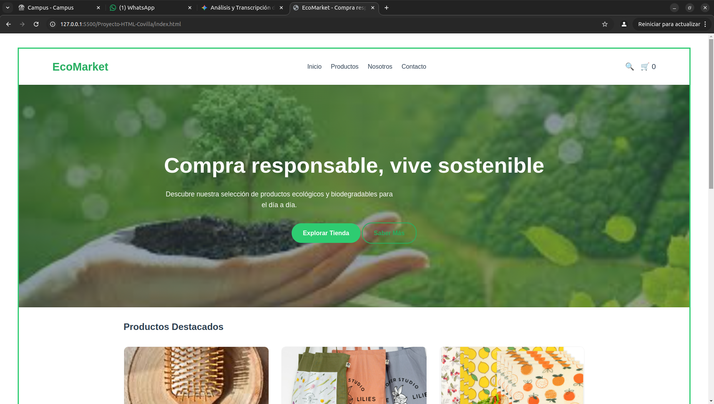
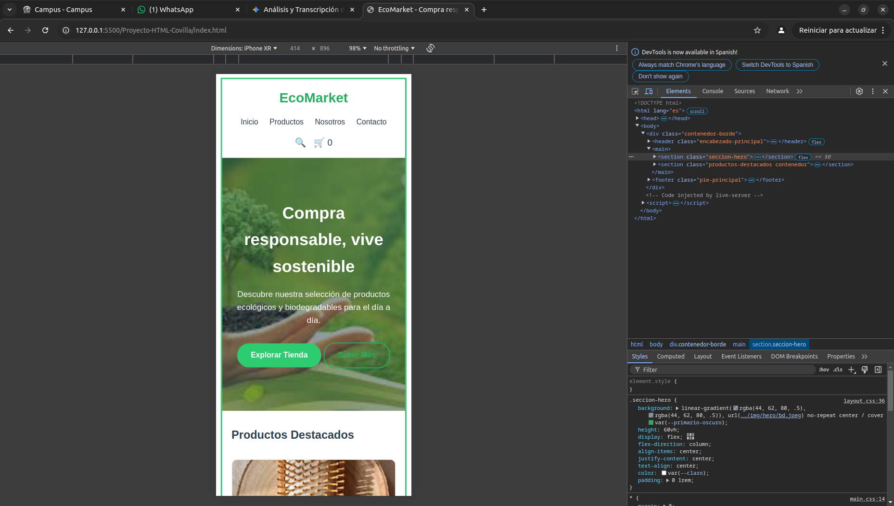
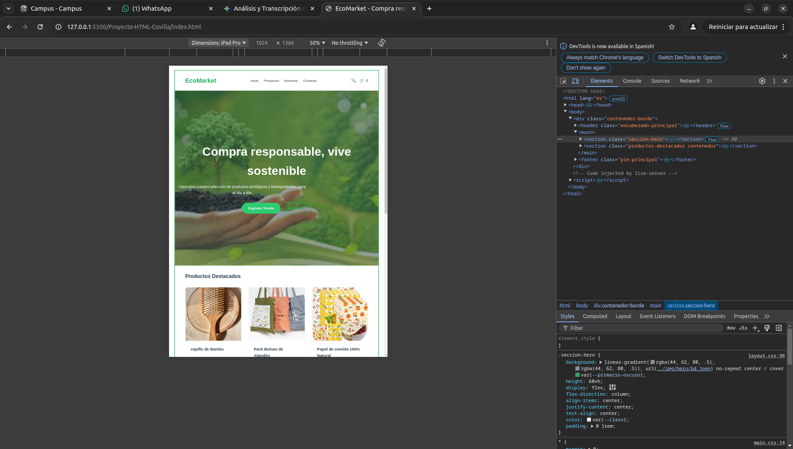

# Proyecto-HTML-Covilla

EcoMarket:
Descripción del proyecto
EcoMarket es una plataforma de comercio electrónico enfocada en la promoción de un estilo de vida consciente y respetuoso con el medio ambiente. El proyecto ofrece un catálogo de productos ecológicos y biodegradables, permitiendo a los usuarios filtrar opciones por categoría y disponibilidad, además de proporcionar información sobre la filosofía y valores de la marca.

Tecnologías utilizadas
El proyecto ha sido desarrollado utilizando estándares web modernos:

HTML5: Estructura semántica del contenido.

CSS3: Estilos, diseño responsivo y animaciones.

    Flexbox & Grid: Para la gestión de layouts complejos.

    Variables CSS: Para una gestión eficiente de la paleta de colores y temas.

    Arquitectura Modular: Organización de estilos en main.css, layout.css, components.css y animations.css.

Diseño Responsivo: Implementación de Media Queries para asegurar la adaptabilidad en dispositivos móviles y de escritorio.

